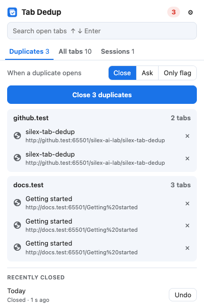
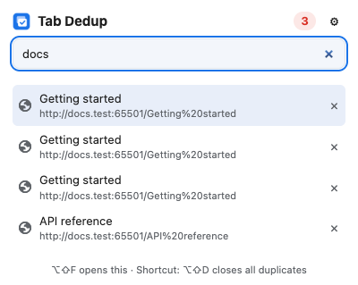
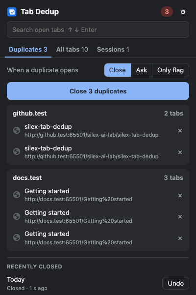

<p align="center">
  
</p>

<h1 align="center">Tab Dedup</h1>

<p align="center">
  <strong>중복 탭은 열리는 즉시 닫고, 닫은 탭은 언제든 되돌립니다.</strong>
</p>

<p align="center">
  <a href="LICENSE"></a>
  <a href="#설치"></a>
  <a href="#권한"></a>
  <a href="https://github.com/silex-ai-lab/silex-tab-dedup/actions/workflows/ci.yml"></a>
  <a href="https://github.com/silex-ai-lab/silex-tab-dedup/stargazers"></a>
</p>

<p align="center">
  <a href="#빠른-시작">빠른 시작</a> · <a href="#기능">기능</a> · <a href="#권한">권한</a> · <a href="#판단-방식">판단 방식</a>
  <br>
  <a href="README.md">English</a> · <a href="README.zh-CN.md">简体中文</a> · <a href="README.ja.md">日本語</a> · 한국어
</p>

---

<sub>영어 README가 공식 버전이며, 이 번역은 늦게 반영될 수 있습니다.</sub>

Manifest V3 Chrome 확장 프로그램입니다. 요청하는 권한이 적고, 네트워크 요청도 텔레메트리도 없습니다. 오픈 소스(MIT)입니다.

<p align="center">
  
  &nbsp;
  
  &nbsp;
  
</p>

> ⭐ **이 저장소에 Star를** 눌러 새 기능과 수정 사항을 받아 보세요. 확장 프로그램이 의존하는 부분을 Chrome이 바꾸면 제가 고치니, 따로 신경 쓰지 않으셔도 됩니다. [Star를 눌러야 하는 이유 →](#-star를-눌러야-하는-이유)

## 왜 Tab Dedup인가?

- 🔁 **그 페이지는 잊고 있던 다른 탭에 이미 열려 있었다** → Tab Dedup이 새 탭을 닫고 원래 열려 있던 탭으로 전환합니다.
- ↩️ **이미 페이지를 보여 주던 탭에서 링크를 클릭했다** → 링크 대상이 다른 탭에 열려 있으면, 그 탭은 닫히지 않고 **이전 페이지로 돌아가** 기록이 유지됩니다.
- 🧯 **엉뚱한 탭을 닫았다** → 닫은 탭은 모두 팝업에서 되돌릴 수 있고, 기록과 함께 복원됩니다.
- 🧹 **같은 페이지인데 URL에 군더더기가 붙었다** → `?utm_source=…`, `fbclid`, `www.`, 끝의 `/`만 다르면 같은 페이지로 봅니다.
- 🛡️ **일부러 두 개를 열었다** → Chrome의 **복제**(**Duplicate**) 명령으로 일부러 복제한 탭, 새로 고친 탭, 복원한 탭은 절대 닫지 않습니다.

### ✅ 설치 전에

| | |
|---|---|
| 💰 **무료 오픈 소스** | MIT 라이선스. |
| 🔒 **네트워크 없음** | 네트워크 요청 없음, 텔레메트리 없음, 계정 불필요. |
| 🧩 **사이트 접근 권한 없음** | 콘텐츠 스크립트도 없어서 확장 프로그램은 어떤 페이지의 내용도 읽거나 바꿀 수 없습니다. [권한](#권한)을 참고하세요. |
| ↩️ **되돌리기** | 닫은 탭은 모두 팝업에서 되돌릴 수 있습니다. |
| 🧪 **CI에서 테스트** | 판단 로직의 단위 테스트와, 확장 프로그램을 Chromium에 로드하는 엔드투엔드 테스트가 있습니다. [브라우저](#브라우저)를 참고하세요. |
| ⚠️ **아직 Chrome 웹 스토어에 없음** | 소스나 릴리스 zip에서 **압축해제된 확장 프로그램을 로드합니다**(**Load unpacked**)로 설치합니다. [설치](#설치)를 참고하세요. |

## 브라우저

| 브라우저 | 상태 |
|---|---|
| Chromium | 엔드투엔드 테스트가 여기서 실행되며, push할 때마다 CI에서 돌아갑니다. |
| Google Chrome 116+ | 확장 프로그램의 최소 버전입니다. **압축해제된 확장 프로그램을 로드합니다**로 설치합니다. 자동 테스트 대상은 아닙니다. 최근 정식 Chrome은 테스트 도구가 압축해제된 확장 프로그램을 로드하도록 허용하지 않습니다. |
| Edge, Brave, Vivaldi, Opera | Chromium 기반입니다. 똑같이 동작할 것으로 예상하지만 테스트하지 않았습니다. |

## 기능

| | |
| --- | --- |
| **세 가지 모드** | *닫기*(기본)는 중복 탭을 닫습니다. *묻기*는 *전환* / *둘 다 유지*를 고르는 알림을 띄웁니다. *표시만*은 배지에 중복 수만 셉니다. |
| **어떤 탭을 남길지** | 고정된 탭이 먼저, 그다음은 먼저 연 탭(원하면 나중에 연 탭)입니다. 고정된 탭은 절대 닫지 않습니다. |
| **팝업** | 페이지별로 묶은 중복 목록, *중복 N개 닫기* 버튼, 각 탭 닫기·이동, **되돌리기**가 있는 *최근에 닫은 탭* 목록. |
| **빠른 검색** | <kbd>Alt</kbd>+<kbd>Shift</kbd>+<kbd>F</kbd>를 누르면 검색창에 커서가 있는 상태로 팝업이 열립니다. 몇 단어를 입력하고 <kbd>↑</kbd> <kbd>↓</kbd>로 고른 뒤 <kbd>Enter</kbd>를 누르면 그 탭으로 전환합니다. |
| **사이트별 전체 탭** | 열려 있는 모든 탭을 사이트별로 묶어 많은 순서로 보여 줍니다. 사이트 전체를 한 번에 닫고, 한 번에 되돌릴 수 있습니다. |
| **세션** | 현재 창이나 모든 창을 저장하고, 저장 후 탭을 닫을 수도 있습니다. 복원할 때는 저장한 창별로 다시 열지만 이미 열려 있는 페이지는 건너뜁니다. 세션 이름 바꾸기, 개별 탭 제거, JSON 또는 어떤 브라우저에서도 가져올 수 있는 북마크 HTML로 내보내기를 지원합니다. 가져오기는 이 확장 프로그램의 JSON, 북마크 파일, Tab Options 내보내기 파일, URL 목록을 받습니다. |
| **단축키** | <kbd>Alt</kbd>+<kbd>Shift</kbd>+<kbd>D</kbd>로 모든 중복 탭을 닫습니다. 두 단축키 모두 `chrome://extensions/shortcuts`에서 바꿀 수 있습니다. |
| **판단 규칙** | 추적 매개변수, `www.`, 끝의 슬래시, `#fragment`, 쿼리 문자열 전체, 대소문자를 무시할 수 있습니다. Gmail처럼 프래그먼트로 페이지를 구분하는 앱이 있어서 기본적으로 프래그먼트는 비교합니다. |
| **중복으로 보지 않음** | 도메인(`mail.google.com`), 와일드카드(`github.com/*/pull/*`) 또는 `/regular expression/`(정규식). |
| **고급 판단** | *같은 페이지로 취급* 규칙(예: `youtube.com/watch*`), *도메인이 여러 개인 사이트*(`yandex.*`), 팝업과 단축키에만 쓰는 제목 일치(선택). |
| **백업** | 설정은 브라우저 계정으로 동기화됩니다. JSON 파일로 내보내기, 가져오기, 초기화도 할 수 있습니다. |
| **범위** | 모든 창 전체 또는 창별. 시크릿 탭은 일반 탭과 일치하지 않으며, 시크릿 창을 완전히 무시할 수도 있습니다. |
| **표시 언어** | 영어와 중국어 간체. |

## 빠른 시작

### 설치

아직 Chrome 웹 스토어에 없습니다. 소스에서 설치하세요:

1. [Releases](https://github.com/silex-ai-lab/silex-tab-dedup/releases)에서 `silex-tab-dedup-<version>.zip`을 내려받아 압축을 풀거나, 이 저장소를 clone합니다.
2. `chrome://extensions`를 열고 **개발자 모드**(Developer mode)를 켭니다.
3. **압축해제된 확장 프로그램을 로드합니다**(Load unpacked)를 클릭하고 `manifest.json`이 있는 폴더를 고릅니다.

clone을 업데이트하려면 `git pull`을 실행한 뒤, `chrome://extensions`에서 확장 프로그램 카드의 새로고침 버튼 ↻을 클릭합니다.

### 처음 2분

1. 아무 페이지나 연 다음, 같은 페이지를 새 탭에서 다시 엽니다. 새 탭이 닫히고 첫 번째 탭으로 돌아옵니다.
2. 툴바 아이콘을 클릭하고 *최근에 닫은 탭* 아래에서 **되돌리기**를 클릭합니다. 탭이 돌아옵니다.
3. <kbd>Alt</kbd>+<kbd>Shift</kbd>+<kbd>F</kbd>를 누르고 탭 제목의 몇 단어를 입력한 뒤 <kbd>Enter</kbd>를 누릅니다.

## 권한

| 권한 | 이유 |
| --- | --- |
| `tabs` | 중복을 찾기 위해 탭의 URL과 제목을 읽고, 탭을 닫거나 앞으로 가져옵니다. |
| `webNavigation` | 탭이 언제, 어떻게 이동했는지(링크인지, 새로 고침·뒤로/앞으로·복원인지) 알아서 새 이동만 처리합니다. |
| `sessions` | 되돌리기: 닫은 탭을 기록과 함께 다시 엽니다. |
| `storage` | 설정(브라우저 계정으로 동기화), 저장한 세션(이 브라우저에만), 되돌리기 목록(메모리에만)을 보관합니다. |
| `notifications` | *묻기* 모드와 선택 사항인 *되돌리기* 알림. |
| `favicon` | 팝업과 세션 페이지에 사이트 아이콘을 Chrome 자체 캐시에서 가져와 보여 줍니다. |

사이트 접근 권한도 콘텐츠 스크립트도 없어서 확장 프로그램은 어떤 페이지의 내용도 읽거나 바꿀 수 없습니다.

## 판단 방식

1. 탭에서 이동이 확정됩니다. 새로 고침, 뒤로/앞으로, 세션 복원, Chrome의 **복제** 명령은 무시합니다.
2. URL을 정규화하고(*판단 규칙* 참고) 범위 안의 다른 탭과 비교합니다. 제외 목록의 URL, 새 탭 페이지, 아직 로딩 중인 탭은 건너뜁니다.
3. 다른 탭이 이미 같은 페이지를 보여 주고 있으면 우선순위가 높은 탭을 남깁니다. 고정된 탭이 먼저, 그다음은 기본적으로 먼저 연 탭입니다.
4. 이동한 탭을 닫습니다. 그 탭이 직전에 다른 페이지를 보여 주고 있었다면 닫지 않고 그 페이지로 돌아갑니다. 닫힌 탭이 앞에 있었다면 남긴 탭으로 포커스가 옮겨집니다.

## 설계 원칙

- **방금 연 것만 처리합니다.** 닫거나 되돌리는 것은 이동한 탭뿐입니다. 다른 곳의 중복은 팝업과 단축키에 맡깁니다.
- **닫은 탭은 모두 되돌릴 수 있습니다.** 팝업의 *최근에 닫은 탭* 목록에서 탭을 기록과 함께 다시 엽니다.
- **페이지가 아니라 탭을 읽습니다.** 사이트 접근 권한도 콘텐츠 스크립트도 없으니 페이지 내용을 보지 않습니다.

## ⭐ Star를 눌러야 하는 이유

저는 Tab Dedup을 매일 쓰기 때문에 계속 관리합니다.

- 기능이나 판단 규칙 요청이 들어오면 추가합니다.
- **무료, 로컬, 가볍게** 유지합니다. 계정 없음, 유료 요금제 없음, 외부 전송 없음, 사이트 접근 권한 없음.
- 확장 프로그램이 의존하는 API를 Chrome이 바꾸면 제가 고칩니다. 직접 지켜볼 필요가 없습니다.

다른 이유:

- 🧪 **설명만이 아니라 테스트합니다.** push할 때마다 CI가 단위 테스트를 돌리고, 확장 프로그램을 Chromium에 로드해 엔드투엔드 테스트를 합니다.
- ↩️ **잃는 것이 없습니다.** 사이트 전체를 한 번에 닫은 경우까지 포함해, 닫은 탭은 모두 팝업에서 되돌릴 수 있습니다.
- 🔒 **권한이 적습니다.** [권한](#권한) 표에 각 권한이 왜 필요한지 적어 두었습니다.
- 🌏 **4개 언어로 읽을 수 있습니다:** 이 README는 English, 简体中文, 日本語, 한국어로 제공됩니다. 확장 프로그램 화면은 영어와 중국어 간체입니다.
- 📣 **다른 사람이 찾기 쉬워집니다.** Star는 탭에 파묻힌 다른 사람들이 Tab Dedup을 찾는 데 도움이 됩니다.

다음에 같은 페이지를 세 개나 열어 두었을 때 다시 찾을 수 있도록 Star를 눌러 두세요. ⭐

## 개발

```sh
npm install
npm test            # unit tests (vitest)
npm run test:e2e    # loads the extension into Chromium with Playwright
npm run lint
npm run package     # dist/silex-tab-dedup-<version>.zip
```

빌드 단계가 없습니다. 순수 ES modules라서 그대로 압축해제된 확장 프로그램으로 로드할 수 있습니다. `src/core/`는 `chrome.*`를 호출하지 않는 순수 로직이라 단위 테스트하기 쉽습니다. `src/background.js`는 service worker입니다. UI 문구는 `scripts/messages.mjs`에 있으며, 수정한 뒤 `npm run locales`를 실행합니다.

로드맵과 다른 중복 탭 확장 프로그램과의 비교는 [PLAN.md](PLAN.md)에 있습니다.

## 라이선스

[MIT](LICENSE) © 2026 Silex AI Lab. 동작은 [Duplicate Tabs Closer](https://github.com/Peuj/duplicate-tabs-closer)(GPL-3.0), [Tab Options](https://github.com/aghontpi/Tab-Options)(Apache-2.0), Clutter Free를 참고했으며 코드는 복사하지 않았습니다.
